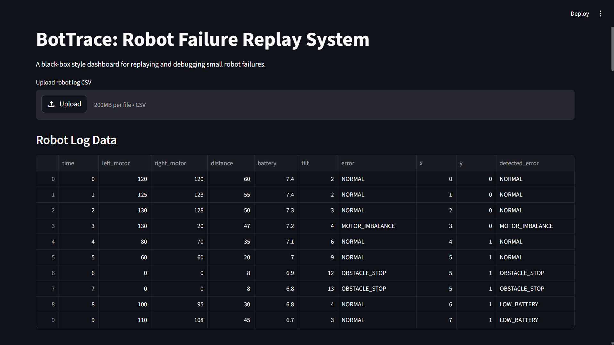
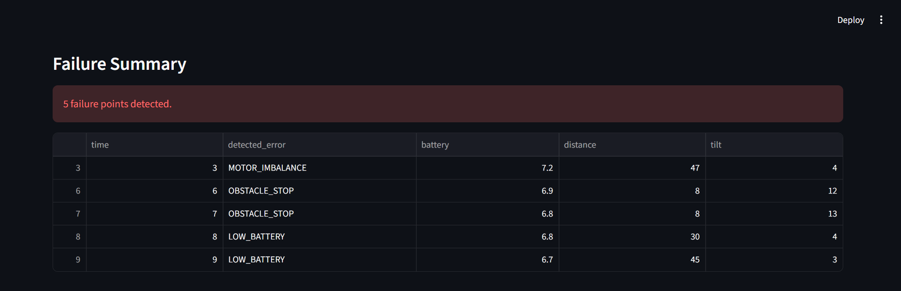
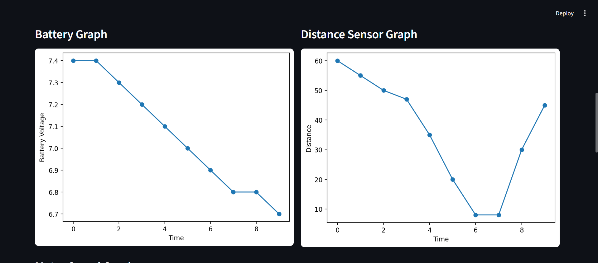
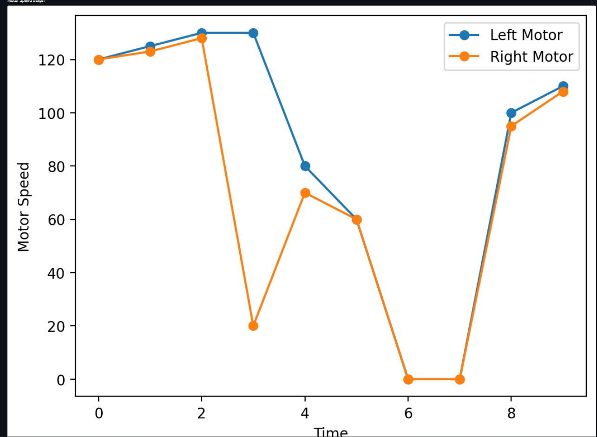
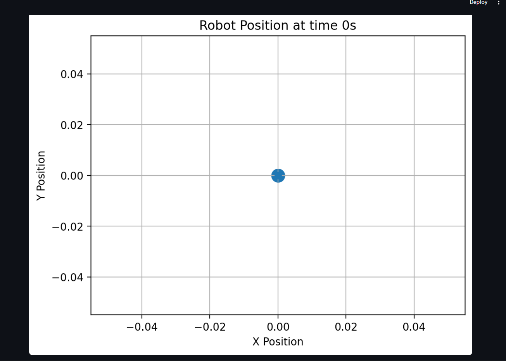
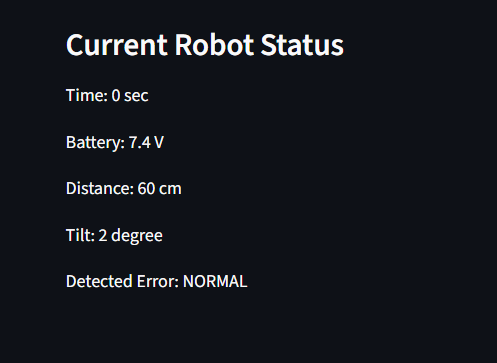

# BotTrace: Robot Failure Replay System

BotTrace is a robot black-box style failure replay system that detects robot failures from log data and visualizes them using a Streamlit dashboard.

---

## Problem

Small robots can fail due to low battery, obstacle detection, motor imbalance, wrong sensor readings, or tilt issues.

After failure, it is difficult to understand what exactly happened during the movement.

---

## Solution

BotTrace stores robot data in CSV format and analyzes it using Python.  
It detects robot failure conditions and shows them on a Streamlit dashboard with graphs and 2D movement replay.

---

## Features

- Robot log data analysis
- Battery monitoring
- Distance sensor monitoring
- Motor speed comparison
- Motor imbalance detection
- Obstacle stop detection
- Robot tilt warning
- Failure summary table
- 2D robot movement replay
- Streamlit-based dashboard
- CSV file support

---

## Tech Stack

- Python
- Pandas
- Matplotlib
- Streamlit
- CSV Dataset

---

## Project Structure

```text
BotTrace-Robot-Failure-Replay-System/
├── data/
│   ├── sample_robot_log.csv
│   └── analyzed_robot_log.csv
├── src/
│   └── failure_detector.py
├── dashboard/
│   └── replay_dashboard.py
├── images/
│   ├── dashboard_home.png
│   ├── failure_summary.png
│   ├── graphs.png
│   ├── motor_speed_graph.png
│   ├── robot_replay.png
│   └── current_status.png
├── README.md
└── requirements.txt
```

## Full project flow

```text
CSV robot data
        ↓
failure_detector.py reads data
        ↓
Python checks battery, motor, distance, and tilt
        ↓
Failure type is detected
        ↓
Dashboard displays graphs and replay
        ↓
User understands why the robot failed

## Dashboard Preview

### Robot Log Data


### Failure Summary


### Battery and Distance Graphs


### Motor Speed Graph


### Robot Position Replay


### Current Robot Status

